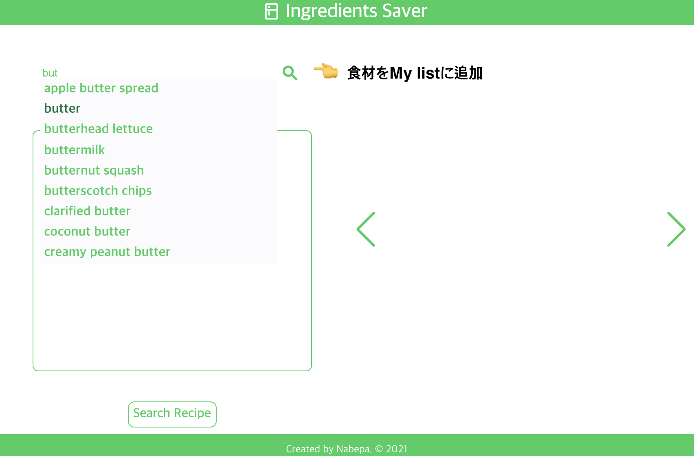

You can try this app, click below badge!
 

Check below if you want to know how to use!

# 🚀 開発背景

- コロナ渦で自宅で料理する機会が増えたが，食材を賞味期限内に消費できず捨ててしまうことが多くなった 🙊
- 早く消費したい食材から作れるレシピーを検索して，食材を使い切ろう ✨
- 検索したレシピーで持っていない食材を教えてもらうことで買い物の時間も減らす ⏱

# ⭐️ 機能

## 使い方

1. 買い物した食材を My list に追加
   
2. My list から消費したい食材を選択して，レシピーを検索
   
3. レシピーを選択して，材料を確認(レシピの詳細はリンクで確認)
   
4. 使い切った材料は My list から削除
   

## 今後目標とする機能

- 条件付き検索(ex. 持っている材料のみで作れるレシピー，選択した材料を全て使うレシピーのみ)
- 材料の消費期限設定とお知らせ

# 🦄 使用技術とツール

    &nbsp;&nbsp;
    &nbsp;&nbsp;
    &nbsp;&nbsp;
    &nbsp;&nbsp;
    &nbsp;&nbsp;
    &nbsp;&nbsp;
 

# 📚 使用ライブラリとリソース， API

[axios](https://github.com/axios/axios): REST API 使用

[spooncular](https://spoonacular.com/food-api): レシピーの API

[swiper](https://swiperjs.com/): レシピーの slider 表示

[google fonts](https://fonts.google.com/icons): 各種アイコ n

This project was bootstrapped with [Create React App](https://github.com/facebook/create-react-app).

# 🐛 改善予定

- ~~Recipe Card が無限に re-render されている~~
  → useEffect 内で unselectedPreshopIds という state を更新し，dependency にも設定していた事で無限ループしていた
  useEffect に setState を利用する際，Dependancy の設定を間違うと無限に re-rendering してしまうので注意
  (June4, 2021)
  ただし，次のような warning が出始めている
  `React Hook useEffect has a missing dependency: 'unselectedPreshopIds'. Either include it or remove the dependency array. You can also do a functional update 'setUnselectedPreshopIds(u => ...)' if you only need 'unselectedPreshopIds' in the 'setUnselectedPreshopIds' call react-hooks/exhaustive-deps`
  →
- ~~Recipe 検索後，ユーザが持っている材料のチェック・追加・削除が Recipe Card の方に反映されない~~
  → チェック・追加は反映できるように修正(June4, 2021)
  ~~ただし，削除した材料がチェックされた材料として残っている~~
  → Item component の child である削除のアイコンをクリックすると，イベントが Item component まで bubbling してくるのが原因だった(そこで，削除と同時にチェエクされてた)(June11, 2021)
- 検索した材料をキーボードの方向キーと enter キーで選択できるように
